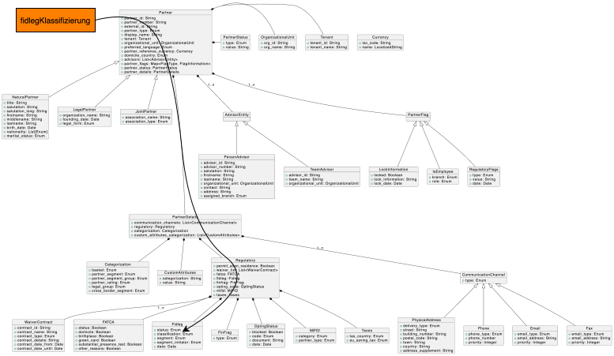

# Partner Domain

The Partner Domain defines information about partners, advisory units, and their relationships within the financial ecosystem. It models the entities responsible for managing client relationships and providing financial advice.

## Context

## Content Structure

### [Partner](partner.yml) ([YAML](partner.yml))
General information about partners, including their identifiers and basic details.

### [Advisory Unit](advisory_unit.yml) ([YAML](advisory_unit.yml))
Definition of advisory units and their role in the advisory process.

### Additional Definitions

- [Partner Base YAML](PartnerBase.yml)

---
*This page is automatically generated from the ontology definition.*
