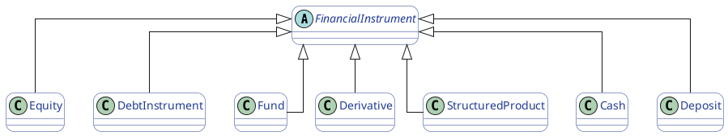
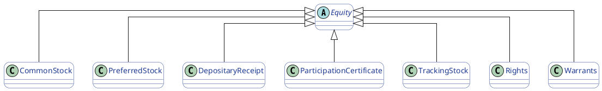
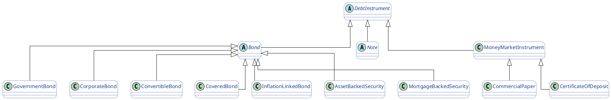
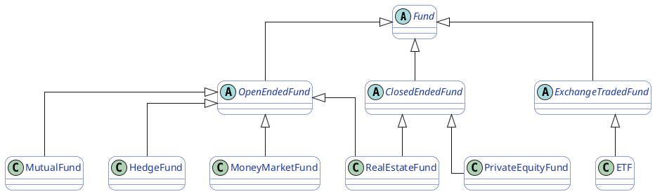
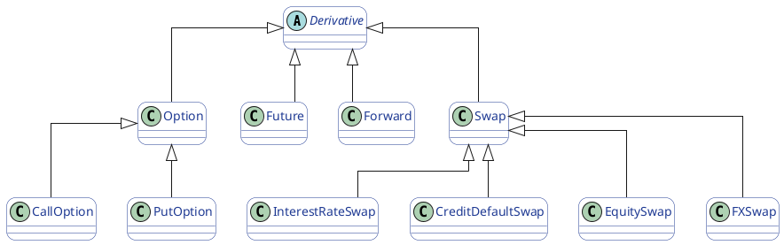
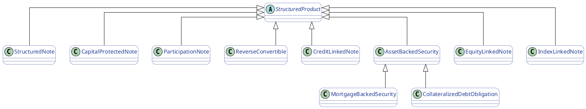
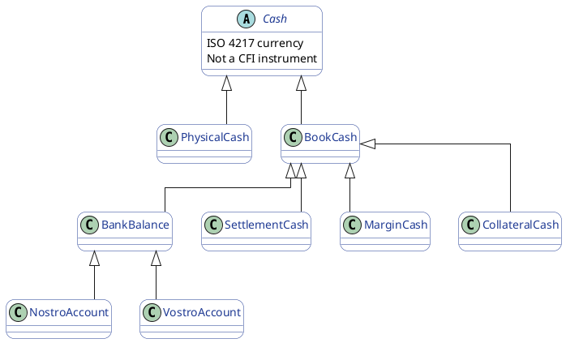
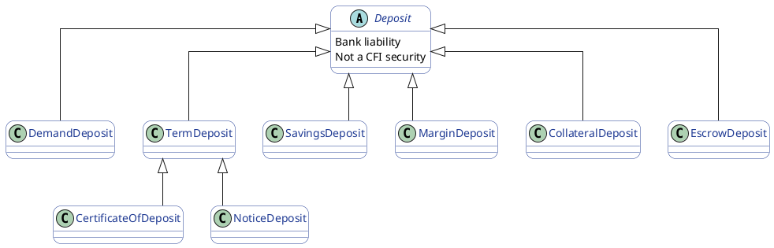

# CFI (Classification of Financial Instruments)

## What is the CFI Classification?

The CFI (Classification of Financial Instruments) is an international standard that provides a structured, machine-readable code to classify financial instruments in a consistent and unambiguous way across markets, asset classes, and systems.

CFI is formally defined in ISO 10962, published by the International Organization for Standardization.
This document provides a comprehensive overview of the financial instruments within the bank data securities domain, covering both the conceptual model and the technical mapping to YAML schemas.

### Purpose of CFI

The primary objective of CFI is to answer a simple but critical question in financial systems:“What kind of financial instrument is this?”

CFI enables systems to classify instruments by structure and economic nature, independently of:

- issuer
- currency
- country
- listing venue
- trading status

This makes it suitable as a foundational reference classification for:

- security master systems
- market data platforms
- trading and risk engines
- regulatory reporting (MiFID II, EMIR, SFTR, etc.)
- custodial and settlement infrastructures

### What CFI Is (and Is Not)

#### What CFI Is

- A global, ISO-standardised taxonomy
- Deterministic (the same instrument always maps to the same CFI)
- Machine-readable (fixed-length alphanumeric code)
- Asset-class agnostic (covers equity, debt, funds, derivatives, structured products)

#### What CFI Is Not

- Not a market identifier (that is MIC / ISO 10383)
- Not an issuer identifier (that is LEI / ISO 17442)
- Not a product name or marketing classification
- Not a valuation or risk model

### CFI Code Structure (Conceptual)

A CFI code consists of six characters, each conveying structural information:

| Position | Meaning (high level)                                       |
| -------: | ---------------------------------------------------------- |
|        1 | Instrument category (Equity, Debt, Fund, Derivative, etc.) |
|        2 | Instrument group                                           |
|        3 | Instrument type                                            |
|        4 | Form / structure                                           |
|        5 | Underlying or payoff characteristic                        |
|        6 | Additional attributes                                      |

### Example (illustrative):

**ESVUFR**

- E → Equity
- S → Share
- V → Voting
- Remaining positions refine structure and rights

The important architectural point is that each position has a fixed semantic meaning, making CFI codes suitable for automated interpretation.

### Why CFI Matters in a Financial Instrument Model

In a domain model, CFI plays a specific and well-defined role:

#### Canonical Instrument Classification

CFI provides a single, authoritative classification axis for what the instrument is, independent of:

- how it is traded
- where it is listed
- who issued it

#### Alignment with Market Infrastructure

CFI is used or expected by:

- exchanges
- custodians
- central securities depositories (CSDs)
- data vendors
- regulators

Using CFI ensures interoperability with external feeds and reports.

#### Stable Mapping Anchor

Your ontology classes (e.g. Equity, Bond, Option, ETF) map cleanly to CFI families:

| Ontology Class    | CFI Family          |
| ----------------- | ------------------- |
| Equity            | `E*…`               |
| DebtInstrument    | `D*…`               |
| Fund              | `C*…`               |
| Derivative        | `O*…`, `F*…`, `S*…` |
| StructuredProduct | `D*…`, `R*…`        |

This allows:

- validation
- enrichment
- cross-system reconciliation

### Why Cash and Deposits Are Excluded?

#### CFI applies only to securities.

In your model:

- Cash → identified by ISO 4217 (currency)
- Deposits → bank liabilities, not tradable securities

#### Their exclusion from CFI is intentional and correct, and aligns with:

- accounting treatment
- regulatory definitions
- custody and settlement logic

### Summary

** CFI classification is the structural backbone of a financial instrument model. **

It provides:

- a globally recognised, ISO-standard definition of instrument type
- deterministic, machine-readable classification
- clean alignment with your ontology hierarchy
- a stable anchor for trading, valuation, risk, and reporting systems

In your architecture, CFI is correctly positioned as the **canonical instrument-type classifier**, while cash and deposits remain outside its scope by design.

## Structural model (class diagram)

### Financial Instrument Main Classes

### Financial Instrument – High-Level Classification

This diagram shows the top-level structure used to classify all tradable financial instruments in the system.
It is aligned with ISO 10962 (CFI) and with how custodians, exchanges, and data vendors organise securities.

At the root is **FinancialInstrument**, which represents any asset that can be issued, traded, held, or valued.

#### Main Instrument Families

**Equity**
Represents ownership in a company or entity (e.g., shares, depositary receipts).
In CFI, equities are identified by codes starting with `ES…`.

**DebtInstrument**
Represents obligations where an issuer owes money to investors (e.g., bonds, notes, commercial paper).
Typical CFI prefixes are `DB…` (bonds) and `DN…` (notes).

**Fund**
Represents collective investment vehicles such as mutual funds, ETFs, and similar structures.
These are classified under CFI codes in the `C*…` range (e.g., `CI…`, `CE…`, `CU…`).

**Derivative**
Represents contracts whose value depends on another underlying (e.g., options, futures, swaps).
CFI codes use families such as `O*…` (options), `F*…` (futures), and `S*…` (swaps).

**StructuredProduct**
Represents securitised or engineered instruments such as structured notes, ABS, or other packaged payoffs.
CFI codes typically fall under securitised debt or structured categories (often `DB…`, `DE…`, or `R*…`).

**Cash**
Represents currency holdings (e.g., EUR, USD).
Cash is not classified with CFI because it is not a security.

**Deposit**
Represents bank deposits and cash accounts.
Like cash, deposits are not classified under CFI and are treated as balance-sheet positions rather than securities.

This classification provides the foundation for reference data, market data, valuation, risk, and regulatory reporting across the platform.

### Full Instrument Classification (Financial Instrument Subclasses)

```plantuml
@startuml
skinparam backgroundColor white
skinparam shadowing false
skinparam linetype ortho
skinparam roundcorner 20

skinparam class {
  BackgroundColor white
  BorderColor #1f3a93
  FontColor #1f3a93
}

' Root
abstract class FinancialInstrument

' Cash & deposits
class Cash
class Deposit

' Equity instruments
class Equity
class CommonStock
class PreferredStock
class DepositaryReceipt

' Debt instruments
class DebtInstrument
class Bond
class Note
class CommercialPaper
class GovernmentBond
class CorporateBond
class ConvertibleBond
class StructuredNote

' Funds
class Fund
class MutualFund
class ETF
class HedgeFund
class PrivateEquityFund

' Derivatives
class Derivative
class Option
class Future
class Forward
class Swap
class CreditDefaultSwap

' Structured & hybrid
class StructuredProduct
class AssetBackedSecurity
class MortgageBackedSecurity
class CollateralizedDebtObligation
class Warrant

' Inheritance
FinancialInstrument <|-- Cash
FinancialInstrument <|-- Deposit
FinancialInstrument <|-- Equity
FinancialInstrument <|-- DebtInstrument
FinancialInstrument <|-- Fund
FinancialInstrument <|-- Derivative
FinancialInstrument <|-- StructuredProduct

Equity <|-- CommonStock
Equity <|-- PreferredStock
Equity <|-- DepositaryReceipt

DebtInstrument <|-- Bond
DebtInstrument <|-- Note
DebtInstrument <|-- CommercialPaper
Bond <|-- GovernmentBond
Bond <|-- CorporateBond
Bond <|-- ConvertibleBond
Bond <|-- StructuredNote

Fund <|-- MutualFund
Fund <|-- ETF
Fund <|-- HedgeFund
Fund <|-- PrivateEquityFund

Derivative <|-- Option
Derivative <|-- Future
Derivative <|-- Forward
Derivative <|-- Swap
Swap <|-- CreditDefaultSwap

StructuredProduct <|-- AssetBackedSecurity
StructuredProduct <|-- MortgageBackedSecurity
StructuredProduct <|-- CollateralizedDebtObligation
StructuredProduct <|-- Warrant

@enduml
```

### Equity Instrument Subclasses

This diagram decomposes the **Equity** instrument class into the main equity types used in security master, trading, and corporate-actions processing.
All of these instruments belong to the ISO-10962 **CFI equity family (`ES…`)** or closely related equity-linked families.

#### CommonStock
Represents ordinary shares that confer ownership and voting rights in a company.
This is the standard form of equity traded on stock exchanges.
CFI codes typically start with `ESV…`.

#### PreferredStock
Represents shares with preferential rights, usually on dividends or liquidation proceeds.
Preferred shares normally do not have the same voting rights as common shares.
CFI codes typically start with `ESP…`.

#### DepositaryReceipt
Represents a negotiable certificate issued by a bank that represents shares in a foreign company
(e.g., ADRs and GDRs).
These instruments allow equities to be traded in markets different from the issuer’s home market.
CFI codes typically start with `ESR…`.

#### ParticipationCertificate
Represents equity instruments that provide economic participation in a company but limited or no voting rights.
These are common in some European markets.
They are classified under equity CFI codes as a variant of common stock.

#### TrackingStock
Represents shares whose value tracks the performance of a specific business unit or segment of a company, rather than the entire firm.
Legally they are equity, but economically they reference a sub-portfolio of the issuer.
They are classified under equity CFI codes.

#### Rights
Represent the entitlement granted to existing shareholders to subscribe to new shares, usually at a discounted price, during a capital increase.
Rights are tradable instruments with their own lifecycle and are classified under the CFI `ER…` family.

#### Warrants
Represent long-dated securities that give the holder the right to buy shares from the issuer at a fixed price.
Although equity-linked, warrants are classified under the CFI `RW…` family and behave more like long-dated options.

Together, these subclasses cover the full spectrum of equity and equity-linked instruments that appear in listing, trading, corporate-actions, and portfolio systems.

### Debt Instrument – Subclasses

This diagram breaks down the **DebtInstrument** class into the main debt products used across security master, trading, valuation, and risk systems.
All of these instruments represent contractual obligations where an issuer must repay principal and, in most cases, pay interest.

#### Bond
Represents long-term debt securities issued by governments, companies, or other entities.
Bonds typically have fixed or floating coupons and a defined maturity.
They are classified mainly under CFI codes starting with `DB…`.

#### GovernmentBond
Bonds issued by sovereign states or government agencies.
They are used as benchmarks for interest rates and are considered low credit risk in their domestic currency.

#### CorporateBond
Bonds issued by private or public companies.
They carry issuer-specific credit risk and are a core instrument for corporate financing.

#### ConvertibleBond
Bonds that can be converted into equity of the issuer under predefined conditions.
They combine debt characteristics (coupons, principal) with equity optionality.

#### CoveredBond
Bonds backed by a pool of high-quality assets (such as mortgages or public-sector loans) that remain on the issuer’s balance sheet.
They provide additional investor protection compared with unsecured bonds.

#### InflationLinkedBond
Bonds where coupons and/or principal are indexed to inflation.
They protect investors against purchasing-power erosion.

#### AssetBackedSecurity (ABS)
Bonds backed by pools of receivables such as credit cards, auto loans, or consumer loans.
Cash flows to investors depend on the performance of the underlying asset pool.

#### MortgageBackedSecurity (MBS)
A specific type of ABS backed by residential or commercial mortgages.
Payments depend on mortgage repayments and prepayments.

#### Note
Represents medium-term debt securities, often issued under medium-term note (MTN) programs.
Notes are structurally similar to bonds but are usually more flexible in issuance and terms.
They are commonly classified under `DN…` CFI codes.

#### MoneyMarketInstrument
Represents short-term debt instruments, typically with maturities of less than one year.
These instruments are used for liquidity management and short-term funding.

#### CommercialPaper
Unsecured short-term debt issued by corporations to finance working capital and short-term obligations.

#### CertificateOfDeposit
A short-term deposit instrument issued by banks, usually tradable and paying a fixed or floating interest rate.

Together, these subclasses cover the full range of **interest-bearing securities** from short-term liquidity instruments to long-dated bonds and securitised products, forming the backbone of fixed-income markets.

### Fund – Subclasses

This diagram breaks down the **Fund** class into the main categories of collective investment vehicles used in asset management, custody, and trading.
All fund instruments fall under the ISO-10962 **CFI “C…” family**, which is dedicated to collective investment products.

#### OpenEndedFund
An open-ended fund continuously issues and redeems units at net asset value (NAV).
Investors can typically subscribe or redeem on each dealing day.
This structure is common for mutual funds, money market funds, and many hedge funds.

#### MutualFund
Traditional collective investment schemes offered to retail and institutional investors.
They invest in diversified portfolios such as equities, bonds, or mixed assets and are priced daily at NAV.

#### MoneyMarketFund
Funds that invest in short-term, high-quality debt instruments to provide liquidity and capital preservation.
They are widely used as cash management vehicles.

#### HedgeFund
Actively managed investment funds using a wide range of strategies (long/short, arbitrage, macro, etc.).
They are usually available only to professional or qualified investors.

#### RealEstateFund (Open-ended variant)
Funds that invest in real estate assets or property companies and allow regular subscriptions and redemptions.

#### ClosedEndedFund
A closed-ended fund issues a fixed number of units at launch.
Units are typically traded on an exchange or OTC, rather than being redeemed by the fund itself.

#### PrivateEquityFund
Closed-ended vehicles that invest in private companies, buyouts, or venture capital.
Capital is committed for long periods and returned as investments are exited.

#### RealEstateFund (Closed-ended variant)
Property funds structured with a fixed capital base, often used for long-term real estate investments.

#### ExchangeTradedFund (ETF)
Funds whose units are traded on a stock exchange like equities.
They provide intraday liquidity and are typically designed to track an index or strategy.
Although ETFs are operationally exchange-traded, they are still collective investment funds under CFI.

Together, these subclasses cover the full range of **collective investment vehicles**, from highly liquid retail funds to illiquid private and alternative investment structures used by institutional investors.

### Derivative – Subclasses

This diagram decomposes the **Derivative** class into the main derivative families used in trading, risk management, and clearing.
Derivatives are contracts whose value depends on an underlying asset, rate, index, or credit entity.
They are classified under the ISO-10962 CFI families `O…`, `F…`, and `S…`.

#### Option
An option gives the holder the right, but not the obligation, to buy or sell an underlying at a fixed price on or before a specified date.
Options are classified under the CFI `O…` family.

#### CallOption
Gives the right to buy the underlying at the strike price.

#### PutOption
Gives the right to sell the underlying at the strike price.

#### Future
A standardized exchange-traded contract to buy or sell an underlying at a future date and price.
Futures are centrally cleared and traded on derivatives exchanges.
They belong to the CFI `F…` family.

#### Forward
A customized over-the-counter (OTC) contract to buy or sell an underlying at a future date and price.
Forwards have similar economics to futures but are bilateral and not exchange-traded.
They are also classified under `F…` CFI families.

##### Swap
A contract in which two parties exchange streams of cash flows based on different financial variables.
Swaps are classified under the CFI `S…` family.

#### InterestRateSwap
Exchanges fixed and floating interest-rate payments on a notional amount.

#### CreditDefaultSwap
Transfers the credit risk of a reference entity from one party to another.

#### EquitySwap
Exchanges the return of an equity or equity index for another return, often a floating interest rate.

#### FXSwap
Combines a spot and a forward foreign-exchange transaction to manage currency funding and liquidity.

Together, these subclasses cover the full range of derivative products used for **hedging, speculation, and risk transfer** across financial markets.

### Structured Product – Subclasses

This diagram describes the **StructuredProduct** family, which includes securitised and engineered instruments whose payoff is defined by one or more underlyings, credit risks, or payoff formulas.
These products are typically issued by banks or special purpose vehicles and are classified in ISO-10962 under structured or securitised debt CFI families (often `DE…`, `DB…`, or `R…`).

#### StructuredNote
A debt security whose return is linked to the performance of an underlying asset, index, or basket.
Unlike plain bonds, the payoff depends on a predefined payoff formula.

#### CapitalProtectedNote
A structured note designed to return at least a minimum amount (often 100% of nominal) at maturity, while providing upside participation in an underlying asset.

#### ParticipationNote
A note that provides linear or non-linear participation in the performance of an underlying (such as an equity or index), typically without capital protection.

#### ReverseConvertible
A high-coupon structured product where the investor is exposed to the downside of an underlying equity or index.
If the underlying falls below a defined level, redemption may occur in shares instead of cash.

#### CreditLinkedNote
A debt instrument where repayment depends on the credit performance of a reference entity.
The investor earns a higher yield but takes on credit risk similar to selling protection via a CDS.

#### AssetBackedSecurity (ABS)
Securities backed by pools of receivables such as loans, leases, or credit card balances.
Investors are repaid from the cash flows generated by the underlying assets.

#### MortgageBackedSecurity (MBS)
A specific type of ABS backed by residential or commercial mortgages.
Cash flows depend on mortgage payments and prepayments.

#### CollateralizedDebtObligation (CDO)
A structured security backed by a portfolio of bonds, loans, or other ABS.
The risk and return are divided into tranches with different credit seniority.

#### EquityLinkedNote
A structured note whose payoff depends on the performance of one or more equities.
These products combine bond-like features with equity exposure.

#### IndexLinkedNote
A structured note linked to the performance of an index (such as an equity, commodity, or volatility index) rather than a single security.

Together, these subclasses cover the major categories of **bank-issued and securitised structured products** used to package market, credit, and yield-enhancement strategies for investors.

### Cash – Subclasses

The **Cash** branch represents currency balances held or exchanged in the financial system.
Unlike securities, cash is **not** classified under ISO-10962 (CFI); it is identified by its **ISO 4217 currency code** (e.g., EUR, USD, CHF) and by where and how it is held.

#### PhysicalCash
Represents banknotes and coins.
This is legal tender that exists outside the banking system and can be physically stored or transported.

#### BookCash
Represents cash recorded in electronic ledgers at banks, custodians, or central counterparties.
Most financial transactions use book cash rather than physical cash.

#### BankBalance
Represents a cash balance held at a bank.
It is the basic building block for payments, settlements, and funding.

#### NostroAccount
A bank account where an institution holds money at another bank (“our money with you”).
These accounts are used for international payments and correspondent banking.

#### VostroAccount
A bank account where another institution holds money at the reporting bank (“your money with us”).
These accounts represent liabilities of the bank to its counterparties.

#### SettlementCash
Cash used to settle securities trades and other financial transactions.
It is linked to settlement systems such as TARGET2, Fedwire, or CLS.

#### MarginCash
Cash posted to clearing houses or counterparties to cover trading risk, especially for derivatives and leveraged positions.

#### CollateralCash
Cash pledged as collateral to secure obligations, such as repo transactions, securities lending, or derivatives exposure.

Together, these subclasses describe how **currency is held, moved, and pledged** across trading, settlement, and risk-management processes in the financial system.

### Deposit – Subclasses

The **Deposit** branch represents cash placed with a bank or financial institution that creates a **liability of the bank to the depositor**.
Deposits are not securities and therefore are **not classified under ISO-10962 (CFI)**, but they are fundamental to funding, liquidity management, and settlement.

#### DemandDeposit
Deposits that can be withdrawn at any time without prior notice.
These include current accounts and checking accounts used for daily payments and cash management.

#### SavingsDeposit
Interest-bearing deposits intended for saving rather than daily transactions.
They usually allow withdrawals, but often with limitations or lower transaction frequency.

#### TermDeposit
Deposits placed for a fixed period at a fixed or floating interest rate.
Funds are locked in until maturity or subject to penalties for early withdrawal.

#### CertificateOfDeposit
A tradable or non-tradable time deposit with a fixed maturity and interest rate.
In wholesale markets, certificates of deposit can be bought and sold between institutions.

#### NoticeDeposit
A deposit that requires a notice period before funds can be withdrawn (e.g., 7, 30, or 90 days).
This allows banks to manage liquidity more efficiently.

#### MarginDeposit
Cash deposited to a broker, exchange, or clearing house to cover trading and counterparty risk.
Used primarily for derivatives, leveraged trading, and securities financing.

#### CollateralDeposit
Cash placed as collateral to secure financial obligations, such as repo transactions, securities lending, or derivatives exposure.

#### EscrowDeposit
Cash held by a third party (escrow agent) pending completion of a transaction, such as a corporate action, acquisition, or settlement.

Together, these subclasses describe how **bank deposits are used as funding, risk mitigation, and settlement instruments** across the financial system.

## Financial Instrument Mapping

This section provides a mapping of financial instruments to their respective ontology representations and YAML schemas within the bank data securities domain.

Each financial instrument is represented by an **Ontology Class**, which is defined in the conceptual model. These classes are implemented using **YAML Schemas**, which are located in the `ontology/bank_data/securities_domain/financial_instruments/instrument/` directory.

### Mapping Table

| Category | Financial Instrument Type | Ontology Class | YAML Schema File |
| :--- | :--- | :--- | :--- |
| Cash & Deposits | Collateral Cash | CollateralCash | collateral_cash.yaml |
| Cash & Deposits | Collateral Deposit | CollateralDeposit | collateral_deposit.yaml |
| Cash & Deposits | Demand Deposit | DemandDeposit | demand_deposit.yaml |
| Cash & Deposits | Escrow Deposit | EscrowDeposit | escrow_deposit.yaml |
| Cash & Deposits | Margin Cash | MarginCash | margin_cash.yaml |
| Cash & Deposits | Margin Deposit | MarginDeposit | margin_deposit.yaml |
| Cash & Deposits | Nostro Account | NostroAccount | nostro_account.yaml |
| Cash & Deposits | Notice Deposit | NoticeDeposit | notice_deposit.yaml |
| Cash & Deposits | Physical Cash | PhysicalCash | physical_cash.yaml |
| Cash & Deposits | Savings Deposit | SavingsDeposit | savings_deposit.yaml |
| Cash & Deposits | Settlement Cash | SettlementCash | settlement_cash.yaml |
| Cash & Deposits | Term Deposit | TermDeposit | term_deposit.yaml |
| Cash & Deposits | Vostro Account | VostroAccount | vostro_account.yaml |
| Debt Instruments | Asset-Backed Security | AssetBackedSecurity | asset_backed_security.yaml |
| Debt Instruments | Certificate of Deposit | CertificateOfDeposit | certificate_of_deposit.yaml |
| Debt Instruments | Commercial Paper | CommercialPaper | commercial_paper.yaml |
| Debt Instruments | Convertible Bond | ConvertibleBond | convertible_bond.yaml |
| Debt Instruments | Corporate Bond | CorporateBond | corporate_bond.yaml |
| Debt Instruments | Covered Bond | CoveredBond | covered_bond.yaml |
| Debt Instruments | Government Bond | GovernmentBond | government_bond.yaml |
| Debt Instruments | Inflation-Linked Bond | InflationLinkedBond | inflation_linked_bond.yaml |
| Debt Instruments | Mortgage | Mortgage | mortgage.yaml |
| Debt Instruments | Mortgage-Backed Security | MortgageBackedSecurity | mortgage_backed_security.yaml |
| Derivatives | Call Option | CallOption | call_option.yaml |
| Derivatives | Credit Default Swap | CreditDefaultSwap | credit_default_swap.yaml |
| Derivatives | Equity Swap | EquitySwap | equity_swap.yaml |
| Derivatives | Forward | Forward | forward.yaml |
| Derivatives | Future | Future | future.yaml |
| Derivatives | FX Forward | FXForward | fx_forward.yaml |
| Derivatives | FX Option | FXOption | fx_option.yaml |
| Derivatives | FX Swap | FXSwap | fx_swap.yaml |
| Derivatives | Interest Rate Swap | InterestRateSwap | interest_rate_swap.yaml |
| Derivatives | Put Option | PutOption | put_option.yaml |
| Derivatives | Total Return Swap | TotalReturnSwap | total_return_swap.yaml |
| Equities | Common Stock | CommonStock | common_stock.yaml |
| Equities | Depositary Receipt | DepositaryReceipt | depositary_receipt.yaml |
| Equities | Participation Certificate | ParticipationCertificate | participation_certificate.yaml |
| Equities | Preferred Stock | PreferredStock | preferred_stock.yaml |
| Equities | Rights | Rights | rights.yaml |
| Equities | Tracking Stock | TrackingStock | tracking_stock.yaml |
| Equities | Warrants | Warrants | warrants.yaml |
| Funds | ETF | ExchangeTradedFund | etf.yaml |
| Funds | Hedge Fund | HedgeFund | hedge_fund.yaml |
| Funds | Money Market Fund | MoneyMarketFund | money_market_fund.yaml |
| Funds | Mutual Fund | MutualFund | mutual_fund.yaml |
| Funds | Private Equity Fund | PrivateEquityFund | private_equity_fund.yaml |
| Funds | Real Estate Fund | RealEstateFund | real_estate_fund.yaml |
