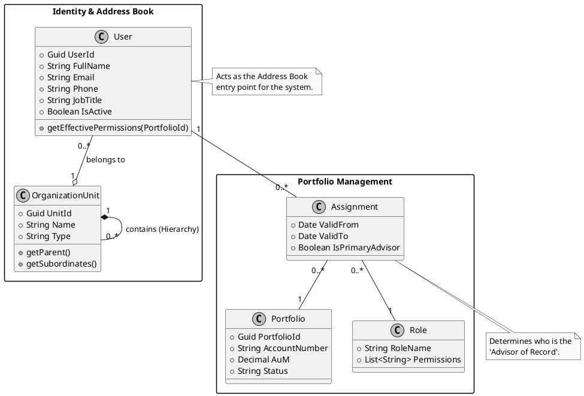

# User

Modeling a banking hierarchy for portfolio management requires a structure that is flexible enough to handle both reporting lines (who manages whom) and **functional roles** (who manages which client).

It acts like an address book and determines access rights, a **Role-Based Access Control (RBAC)** model layered over a Tree or Graph structure is usually the most effective approach.

## 1. The Core Hierarchy Structure

To handle "advisors" and "portfolio roles," you need to distinguish between the **Organizational Hierarchy** and the **Client Assignment Layer**.

### A. The Organizational Tree

This represents the bank's internal staff. It defines who is a Senior Advisor, a Junior Advisor, or a Compliance Officer.

- **Nodes**: Users (Staff).
- **Edges**: "Reports to" or "Member of [Team/Branch]."

### B. The Client-Portfolio Mapping

This is where the "Address Book" functionality lives. Instead of a simple 1:1 link, use an Assignment Table that connects staff to specific portfolios or clients with a "Role Type."

#### Portfolio Access Control Mapping

| Staff Member   | Portfolio ID   | Role         | Rights Derived                      |
|:---------------|:---------------|:-------------|:------------------------------------|
| **Jane Doe**   | `Portfolio_A`  | Lead Advisor | Full Read/Write, Execute Trades     |
| **John Smith** | `Portfolio_A`  | Assistant    | Read Only, Prep Reports             |
| **Sarah Lee**  | `Region_North` | Compliance   | Audit View (All Portfolios in Node) |

#### Understanding Role-Based Access Control (RBAC)

This table illustrates a **Role-Based Access Control** system common in wealth management and institutional trading platforms. It ensures data security and operational integrity through three distinct levels of access:

- **Executive/Transactional Access**: **Jane Doe** holds the highest level of authority for a specific portfolio, allowing her to both modify data and commit capital (**Execute Trades**). 
- **Operational/Support Access**: **John Smith** has restricted access. He can view the data necessary to perform his job (**Prep Reports**) but cannot alter positions or execute trades, providing a necessary layer of internal control.
- **Oversight/Audit Access**: **Sarah Lee** has broad visibility across a geographical node (Region_North) rather than a single account. Her **Audit View** is critical for regulatory compliance, ensuring that all portfolios within her region adhere to internal and external rules without her having the ability to influence trading activities.

### 2. Deriving User Rights

Rights shouldn't be hardcoded to the user; they should be derived from the Intersection of their Position and their Assignment.

#### The Inheritance Logic

1. **Direct Assignment**: You are the Lead Advisor for Client X $\rightarrow$ Full Access.
2. **Managerial Inheritance**: You manage the Lead Advisor for Client X $\rightarrow$ Oversight Access.
3. **Functional Role**: You are in the "Tax Department" $\rightarrow$ Access to tax documents only, regardless of the advisor.

### 3. Data Schema Example (JSON/Relational Style)

To make this searchable like an address book, your "User" object needs to store metadata and relationships.

```json
{
  "user_id": "U123",
  "name": "Alex Rivera",
  "position": "Senior Wealth Manager",
  "org_path": "/Global/Europe/Zurich/PrivateBanking",
  "assignments": [
    {
      "entity_type": "Portfolio",
      "entity_id": "P_990",
      "role": "Lead_Advisor",
      "permissions": ["trade", "view_balances", "edit_client_info"]
    },
    {
      "entity_type": "Team",
      "entity_id": "Junior_Advisors_Group",
      "role": "Supervisor",
      "permissions": ["approve_trades"]
    }
  ]
}
```

## 4. Key Considerations for Implementation

- The **"Acting For" Capability**: In banking, advisors often go on leave. Your model should support Delegation (temporary rights transfer) without changing the primary hierarchy.
- **Audit Trails**: Since this determines rights, every change in the "address book" must be versioned. You need to know who was the advisor of record on a specific date in the past.
- **The "Four Eyes" Principle**: Ensure your hierarchy logic prevents a user from occupying two roles that should be segregated (e.g., an Advisor shouldn't be their own Compliance Officer).

## Implementation

To build this effectively, we need to move from a flat list to a relational model that supports inheritance. In banking, rights often flow "down" the tree (a Branch Manager sees everything their Advisors see).

Here is a proposed structure and a high-level Entity Relationship (ER) overview.

### 1. The Entity Relationship (ER) Logic

We break the system into three main pillars: Identity (Who), Hierarchy (Where they sit), and Mandate (What they are assigned to).

### 2. Proposed SQL Schema

This schema allows a user to have a primary place in the "Address Book" while holding different functional roles across various portfolios.

```sql
-- 1. The Org Units (Branches, Teams, Departments)
CREATE TABLE OrganizationUnits (
    unit_id INT PRIMARY KEY,
    parent_unit_id INT REFERENCES OrganizationUnits(unit_id),
    unit_name VARCHAR(100),
    unit_type VARCHAR(50) -- e.g., 'Branch', 'Team', 'Division'
);

-- 2. The Users (The "Address Book" Core)
CREATE TABLE Users (
    user_id INT PRIMARY KEY,
    unit_id INT REFERENCES OrganizationUnits(unit_id),
    full_name VARCHAR(255),
    job_title VARCHAR(100),
    is_active BOOLEAN DEFAULT TRUE
);

-- 3. The Functional Roles (The 'Rights' Template)
CREATE TABLE Roles (
    role_id INT PRIMARY KEY,
    role_name VARCHAR(50), -- e.g., 'Lead Advisor', 'Compliance', 'Read-Only Assistant'
    permission_mask BIT(16) -- Binary representation of specific actions
);

-- 4. The Assignment (The Link to the Portfolio)
CREATE TABLE PortfolioAssignments (
    assignment_id SERIAL PRIMARY KEY,
    user_id INT REFERENCES Users(user_id),
    portfolio_id INT, -- Link to your Portfolio/Client table
    role_id INT REFERENCES Roles(role_id),
    valid_from DATE,
    valid_to DATE
);
```

### 3. How Rights Are Derived

When a user logs in, the system calculates their "Effective Permissions" by checking two paths:

1. **Direct Path**: Look at PortfolioAssignments. If I am the "Lead Advisor" for Portfolio A, I get those specific rights.
2. **Hierarchical Path**: If I am the Manager of Unit_ID 10, and an advisor in my unit is assigned to Portfolio B, the system grants me "Oversight" rights to Portfolio B automatically through the OrganizationUnits tree.

### 4. Address Book Features

To make this serve as a functional address book, you should implement **Attribute-Based Searching**:

- **Breadcrumbs**: "Alex Rivera > Zurich Branch > Private Wealth Team B".
- **Substitution**: Add a substitute_user_id column to the Users table to handle holiday cover or temporary handovers without breaking the permanent hierarchy.

### 5. Benefits of this Approach

- **Scalability**: You can add a "Junior Advisor" to a portfolio without changing the portfolio's ownership
- **Security**: If an advisor leaves the bank, you simply deactivate their User record or change their unit_id, and all derived rights vanish instantly.
- **Auditability**: The PortfolioAssignments table acts as a historical log of who looked after which client and when.

## Implementation Guidelines

### 1. Class Diagram

This diagram shows the relationship between the staff (Users), the bank's structure (Units), and the client assets (Portfolios).



#### Breakdown of the Model

- **Recursive OrganizationUnit**: This allows the "Address Book" to scale from a small local branch to a global enterprise. A Unit can be a Team, a Branch, a Region, or a Country.
- **The Assignment Class**: This is the "secret sauce." Instead of linking a User directly to a Portfolio, this middle class stores the **metadata** of the relationship. It answers:
  - *Why* is this person in the client's address book? (Role)
  - *When* did they start looking after them? (ValidFrom)
- **Permission Inheritance**: The getEffectivePermissions method on the User class would be responsible for looking up the Assignment and checking the Role permissions.

#### How this derives User Rights

When the system renders the "Client Profile," it queries the *Assignment* table.

1. **Lead Advisor**: Gets READ, WRITE, EXECUTE_TRADE
2. **Assistant**: Gets READ, WRITE, but EXECUTE_TRADE is restricted.
3. **Inherited Manager**: If a manager clicks into a portfolio managed by their subordinate, the system identifies the OrganizationUnit link and grants READ_ONLY oversight rights


### 2. Permission Calculation Logic (Pseudocode)

In a banking context, "Who is the advisor?" is often a recursive question. If a Junior Advisor is busy, the Senior Advisor in their hierarchy needs to be able to step in.

Here is how you would implement a function to check if a user has a specific right (e.g., TRADE) on a portfolio:


```code 
def has_permission(user_id, portfolio_id, required_permission):
    # 1. Check Direct Assignment
    # Does this user have a specific role assigned to this portfolio?
    assignment = DB.query("SELECT role FROM PortfolioAssignments 
                           WHERE user_id = ? AND portfolio_id = ?", user_id, portfolio_id)
    if assignment and required_permission in assignment.role.permissions:
        return True

    # 2. Check Hierarchical Inheritance
    # Is the user a manager of someone who is assigned to this portfolio?
    subordinates = get_all_subordinates_recursive(user_id)
    for sub_id in subordinates:
        if has_direct_assignment(sub_id, portfolio_id):
            return True # Managers inherit view/oversight rights

    # 3. Check Global/Regional Roles
    # Is the user a 'Compliance Officer' for the entire Branch?
    user_unit = DB.query("SELECT unit_id FROM Users WHERE user_id = ?", user_id)
    if is_compliance_for_unit(user_id, user_unit) and required_permission == "VIEW":
        return True

    return False
```

### 3. Implementing the "Address Book" View

Since you want this to function like an address book, your UI should leverage the hierarchy to provide Contextual Contact Information.

- **The "Team" View**: When looking at a Portfolio, the "Address Book" doesn't just show one name. It shows a Service Team:
  - *Lead Advisor*: Alex Rivera (Senior)
  - *Assistant*: Sarah Chen (Junior)
  - *Compliance*: Marc Low (Regional Office)
- **The "Reporting Line" View:** When looking up a staff member, it shows their "Up-line" (Managers) and "Down-line" (Direct Reports), making it easy to find an escalation contact.

### 4. Security & Compliance "Guardrails"

In a real banking system, you must add these constraints to your model:

- **Segregation of Duties**: A validation rule that prevents the same user_id from being both the Lead_Advisor and the Compliance_Officer on the same portfolio_id.
- **Temporal Logging**: Use valid_from and valid_to timestamps on every assignment so you can "time travel" to see who had access during a specific suspicious trade six months ago.


